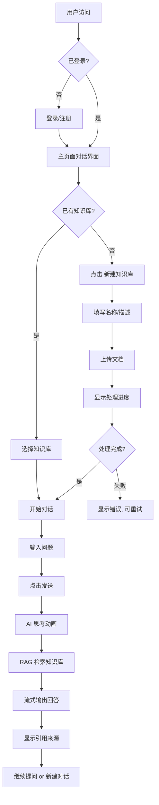
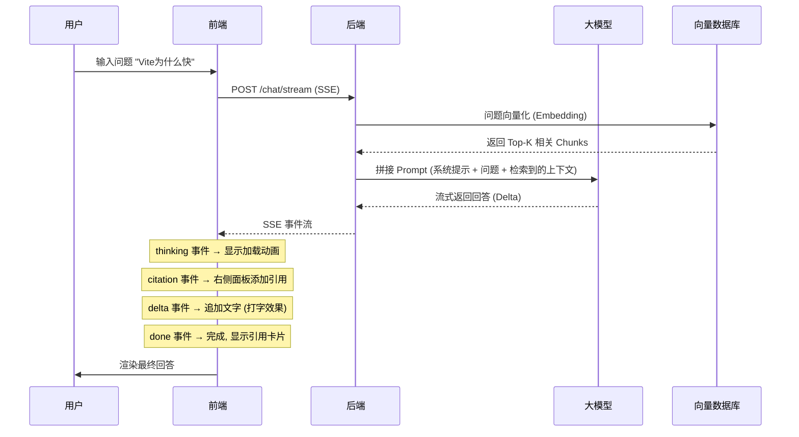

# 产品需求文档 (PRD) - AI 知识库智能问答平台 v2.0

## 1. 项目定位与目标

### 1.1 一句话描述

> **"让 AI 真正理解你的团队知识，并给出可信的回答。"**

### 1.2 核心价值主张

- ✅ **上传即学习**: 支持 PDF/Markdown/TXT 上传，自动解析、切片、向量化
- 🤖 **智能对话**: 类 ChatGPT 的多轮对话体验，支持追问、澄清
- 🔍 **精准检索**: RAG 架构保证回答基于真实知识，而非 AI 瞎编
- 📚 **引用溯源**: 每个回答都标注来源文档和原文位置，可验证、可点击跳转
- 👥 **团队协作**: 多人共享知识库，支持角色权限（Admin/Editor/Viewer）

### 1.3 本质定位

```
传统知识库 + AI 问答 + RAG 检索 = 可信的知识智能平台
```

### 1.4 参考产品

- **ChatGPT + Notion**: 对话体验 + 知识管理
- **Dify**: 工作流编排 + 知识库
- **飞书 AI 知识库**: 企业级知识问答
- **Perplexity**: 引用来源展示

---

## 2. MVP 范围（第一阶段）

### 2.1 核心链路（必须完成）

```
上传文档 → AI 自动学习 → 用户提问 → AI 回答（带引用来源）
```

### 2.2 不做（后期迭代）

- ❌ Agent 自动化任务
- ❌ MCP 协议集成
- ❌ AI 长期记忆
- ❌ 复杂的工作流编辑器
- ❌ 多租户 SaaS 化

---

## 3. 用户系统

### 3.1 认证方式

| 方式         | 优先级 | 说明       |
| ------------ | ------ | ---------- |
| 邮箱+密码    | P0     | 基础登录   |
| GitHub OAuth | P1     | 开发者友好 |
| Google OAuth | P1     | 企业用户   |

### 3.2 角色权限（简化版）

| 角色       | 权限范围                                    |
| ---------- | ------------------------------------------- |
| **Admin**  | 创建/删除知识库、管理成员、所有操作         |
| **Editor** | 上传/编辑文档、发起对话、管理自己创建的内容 |
| **Viewer** | 仅查看知识库和对话历史、不能修改任何内容    |

### 3.3 用户信息

```typescript
interface User {
  id: string;
  name: string;
  email: string;
  avatar: string; // 头像 URL
  role: 'admin' | 'editor' | 'viewer';
  createdAt: Date;
}
```

---

## 4. 知识库模块 ⭐ 核心

### 4.1 知识库概念

一个**知识库 (Knowledge Base)** 是一组相关文档的集合，包含:

- 多个文档 (Documents)
- 多轮对话 (Conversations)
- 多个成员 (Members)

**示例知识库**:

- `前端开发手册`
- `产品需求文档 (PRD)`
- `API 接口文档`
- `智能提示词模板库`
- `公司内部 Wiki`

### 4.2 知识库 CRUD

- **创建**: 名称、描述、封面图、可见性(公开/私有)
- **编辑**: 修改基本信息
- **删除**: 删除知识库及其所有数据（需二次确认）
- **列表/搜索**: 按名称搜索、按创建时间排序、按成员数排序

### 4.3 成员管理 (P1)

- 邀邀成员加入知识库
- 设置成员角色
- 移除成员

---

## 5. 文档管理 ⭐⭐ 重点

### 5.1 支持的文件格式 (MVP)

| 格式         | 扩展名 | 优先级 | 解析方式     |
| ------------ | ------ | ------ | ------------ |
| **PDF**      | `.pdf` | P0     | PyPDF2/pdfjs |
| **Markdown** | `.md`  | P0     | 直接读取文本 |
| **纯文本**   | `.txt` | P0     | 直接读取     |

**后期扩展** (P2): Word(.docx), PPT(.pptx), Notion 导入, 飞书文档, GitHub Repo

### 5.2 上传流程 UI

```
选择文件 (拖拽/点击)
    ↓
显示上传进度
    ↓
解析中... (显示解析进度条)
    ↓
切片 Chunk 中... (已切 X/Y 块)
    ↓
向量化 Embedding 中... (已完成 N%)
    ↓
✅ 完成 (可开始提问)
```

### 5.3 文档状态枚举

```typescript
enum DocumentStatus {
  UPLOADING = 'uploading', // 上传中
  PARSING = 'parsing', // 解析内容
  CHUNKING = 'chunking', // 切片中
  EMBEDDING = 'embedding', // 向量化中
  COMPLETED = 'completed', // ✅ 就绪可用
  FAILED = 'failed', // ❌ 失败（显示错误原因）
}
```

### 5.4 文档列表页

**展示字段**:

- 文档标题
- 文件类型图标 (PDF/MD/TXT)
- 文件大小 (格式化: 1.2 MB)
- 当前状态 (彩色 Tag)
- 上传时间 (相对时间: "3小时前")
- 上传者头像+名字
- 操作按钮: 查看/下载/删除

**筛选/排序**:

- 按状态筛选 (全部/处理中/完成/失败)
- 按类型筛选
- 按时间排序 (最新/最旧)

### 5.5 文档详情/预览

- **只读模式**: 展示文档原始内容
- **目录导航**: 自动生成 TOC (Table of Contents)
- **全文搜索高亮**: 在预览中搜索关键词
- **元信息面板**: 显示文件大小、页数/字数、Chunk 数量、上传时间等

---

## 6. AI 对话模块 ⭐⭐⭐ 核心亮点

### 6.1 页面布局（知识库 / AI 对话双模式）

```
┌─────────────────────────────────────────────────────┐
│                     顶部搜索栏                        │
├──────────┬──────────────────────────┬───────────────┤
│          │                          │               │
│  左侧导航  │   中间主内容区域          │  右侧信息面板  │
│          │                          │               │
│  工作台    │  知识库模式:              │  文档属性      │
│  知识库 ✅ │  ┌────────────────────┐  │  文件大小      │
│  AI对话    │  │ 我的知识合集         │  │  上传者        │
│  项目资料  │  │ 文档1 / 文档2 / 文档3 │  │  智能摘要      │
│          │  │ 点击文档后中间展开详情 │  │  关键要点      │
│  我的知识库 │  └────────────────────┘  │               │
│  KB1      │                          │               │
│  KB2      │  AI 对话模式:             │  引用来源      │
│  KB3      │  ┌────────────────────┐  │  来源文档      │
│          │  │ 多轮问答消息流        │  │  引用段落      │
│  +新建    │  │ 输入框 / 发送按钮     │  │  匹配度        │
│          │  └────────────────────┘  │               │
└──────────┴──────────────────────────┴───────────────┘
```

**布局说明**:

| 区域         | 宽度            | 功能                                                                      |
| ------------ | --------------- | ------------------------------------------------------------------------- |
| **左侧导航** | 248px           | 一级入口切换：工作台、知识库、AI 对话、项目资料；下方展示“我的知识库”列表 |
| **中间主区** | flex-1 (自适应) | 知识库模式展示已导入知识合集；AI 对话模式展示多轮问答                     |
| **右侧面板** | 320px           | 知识库模式显示文档属性与智能摘要；AI 对话模式显示引用来源与历史对话       |

**关键交互**:

- 点击左侧“知识库”：中间切换为“我的知识合集”，展示当前知识库下已导入文档。
- 点击左侧“AI 对话”：中间切换为问答界面，问答范围默认为当前选中的知识库。
- 左侧二级区域随入口变化：知识库模式显示“我的知识库”；AI 对话模式显示“历史记录”。
- 点击左侧“我的知识库”中的某个知识库：中间刷新为该知识库的导入资料合集。
- 点击中间任意知识条目：该条目在中间直接展开，展示中文解析内容、重点摘要、知识片段示例和操作按钮。
- 导入 `.md/.txt` 文件后，中间展开区展示真实文本内容；导入 PDF 时展示文件信息和待解析提示，后续由解析服务补充正文。
- 右侧面板随中间内容联动：展开文档时显示文档属性和智能摘要；进行对话时显示引用来源。

### 6.2 对话交互流程

#### 发送问题

```
用户在输入框输入问题
    ↓
点击发送 / 按 Enter
    ↓
消息气泡出现在右侧 (用户头像)
    ↓
AI 开始思考 (显示加载动画: 三个点跳动 / 打字机效果)
    ↓
AI 回答出现 (左侧, 带引用标记)
```

#### 回答结构

每个 AI 回答包含:

1. **正文**: Markdown 渲染的文本内容
2. **引用块**: 内嵌的引用卡片, 点击可跳转
3. **来源列表**: 右侧面板同步更新

**引用卡片样式**:

```markdown
根据《Vite 原理分析》第 3 段：

> Vite 利用浏览器原生的 ES Module 支持...
>
> [点击查看原文 →] [📄 vite.md]
```

#### 多轮对话

- 支持上下文理解 ("它" 指代上文提到的概念)
- 支持追问 ("那 X 的具体用法是什么?")
- 支持纠正 ("不对，应该是 Y")
- 对话历史滚动加载 (分页或无限滚动)

### 6.3 输入框增强

- **快捷键**: Enter 发送, Shift+Enter 换行
- **@提及**: `@` 触发文档/知识库快速选择
- **粘贴图片**: 支持粘贴截图提问
- **字符限制**: 单次最大 2000 字符

### 6.4 对话历史

- **自动保存**: 每次对话自动存储
- **对话列表**: 左侧边栏显示历史对话标题 (取第一条消息摘要)
- **切换对话**: 点击可切换到之前的对话
- **新建对话**: 清空当前上下文, 开始新对话
- **重命名**: 修改对话标题
- **删除**: 删除整段对话记录

---

## 7. 引用来源系统 ⭐⭐⭐ 差异化亮点

### 7.1 为什么重要?

```
用户痛点: "AI 有没有胡说?"
解决方案: "每句话都有据可查"
```

### 7.2 引用卡片组件

**触发场景**: 当 AI 回答中引用了某篇文档的某段内容时

**UI 设计**:

```tsx
<CitationCard
  sourceTitle="Vite 原理分析.md" // 文档标题
  sourceIcon="file-pdf" // 文件类型图标
  preview="Vite 利用浏览器原生..." // 引用内容预览 (最多2行)
  position="第 3 段" // 位置信息
  confidence={0.95} // 相似度置信度 (可选)
  onClick={() => openPreview()} // 点击打开文档预览并高亮
/>
```

**视觉特征**:

- 左侧竖线颜色编码 (不同文档不同颜色)
- 小图标标识文件类型
- Hover 效果: 卡片轻微上浮 + 阴影加深
- 点击反馈: 明显的点击态

### 7.3 右侧来源面板

**实时同步**: 当 AI 正在生成回答时, 右侧面板实时显示已检索到的来源

**面板功能**:

- **来源列表**: 按相关性排序的所有引用来源
- **过滤**: 只看某个文档的引用
- **展开/折叠**: 默认只显示预览, 点击展开完整内容
- **跳转**: 点击直接跳转到文档预览页对应位置

### 7.4 文档预览中的引用高亮

当用户点击引用卡片时:

1. 打开文档预览 (中间区域 or 弹窗)
2. **自动滚动到被引用的段落**
3. **高亮显示**该段落 (黄色背景 + 左侧竖线)
4. 显示上下文 (前后各 2-3 句)

---

## 8. 技术约束 (前端)

### 8.1 技术栈选型

| 类别         | 技术                    | 版本   | 用途        |
| ------------ | ----------------------- | ------ | ----------- |
| **框架**     | React                   | 18.x   | UI 渲染     |
| **构建工具** | Vite                    | 6.x    | 开发构建    |
| **UI 库**    | Ant Design              | 5.x    | 基础组件    |
| **状态管理** | Zustand                 | 5.x    | 全局状态    |
| **路由**     | React Router            | 7.x    | SPA 路由    |
| **HTTP**     | Axios                   | 1.x    | API 请求    |
| **Markdown** | remark + rehype         | latest | AI 回答渲染 |
| **代码高亮** | Prism.js / Shiki        | latest | 代码块渲染  |
| **语言**     | TypeScript              | 5.x    | 类型安全    |
| **样式**     | CSS Modules + Variables | -      | 样式隔离    |

### 8.2 设计规范

- **主色调**: `#1677ff` (Ant Design 蓝)
- **辅助色**:
  - 成功/完成: `#52c41a` (绿)
  - 进行中: `#1677ff` (蓝)
  - 失败/错误: `#ff4d4f` (红)
  - 引用高亮: `#faad14` (金黄)
- **字体**: 系统默认字体栈 (SF Pro / Segoe UI / PingFang SC)
- **圆角**: 8px (大) / 6px (中) / 4px (小)
- **阴影**:
  - 卡片: `0 2px 8px rgba(0,0,0,0.08)`
  - 浮层: `0 8px 24px rgba(0,0,0,0.12)`
- **间距**: 基于 4px 网格 (4/8/12/16/24/32)

### 8.3 响应式断点

| 设备    | 宽度           | 布局调整                 |
| ------- | -------------- | ------------------------ |
| Desktop | > 1200px       | 三栏完整布局             |
| Tablet  | 768px - 1200px | 右侧面板折叠为抽屉       |
| Mobile  | < 768px        | 左侧边栏抽屉化, 对话全屏 |

---

## 9. API 接口设计 (前端调用)

### 9.1 认证接口

```
POST   /api/auth/register         # 注册
POST   /api/auth/login            # 登录
POST   /api/auth/logout           # 登出
GET    /api/auth/me               # 获取当前用户信息
POST   /api/auth/github           # GitHub OAuth 回调
POST   /api/auth/google          # Google OAuth 回调
```

### 9.2 知识库接口

```
POST   /api/knowledge-bases              # 创建知识库
GET    /api/knowledge-bases              # 获取我的知识库列表
GET    /api/knowledge-bases/:id          # 获取知识库详情
PUT    /api/knowledge-bases/:id          # 更新知识库信息
DELETE /api/knowledge-bases/:id          # 删除知识库
POST   /api/knowledge-bases/:id/members # 邀请成员
GET    /api/knowledge-bases/:id/members # 成员列表
DELETE /api/knowledge-bases/:id/members/:userId # 移除成员
```

### 9.3 文档接口

```
POST   /api/knowledge-bases/:kbId/documents        # 上传文档
GET    /api/knowledge-bases/:kbId/documents        # 文档列表
GET    /api/knowledge-bases/:kbId/documents/:docId # 文档详情 (含内容)
DELETE /api/knowledge-bases/:kbId/documents/:docId # 删除文档
GET    /api/knowledge-bases/:kbId/documents/:docId/content # 获取文档原始内容 (用于预览)
GET    /api/knowledge-bases/:kbId/documents/:docId/status  # 查询处理状态 (轮询)
```

### 9.4 AI 对话接口 ⭐ 核心

```
POST   /api/knowledge-bases/:kbId/conversations           # 创建新对话
GET    /api/knowledge-bases/:kbId/conversations           # 对话列表
GET    /api/knowledge-bases/:kbId/conversations/:chatId # 对话详情 (含消息历史)
DELETE /api/knowledge-bases/:kbId/conversations/:chatId # 删除对话
PUT    /api/knowledge-bases/:kbId/conversations/:chatId # 重命名对话

POST   /api/knowledge-bases/:kbId/conversations/:chatId/messages  # 发送消息 (用户提问)
GET    /api/knowledge-bases/:kbId/conversations/:chatId/messages  # 获取消息历史 (分页)
```

### 9.5 流式响应 (SSE) ⭐ 重要

```
POST   /api/knowledge-bases/:kbId/chat/stream
Headers: { Accept: text/event-stream }

返回 SSE (Server-Sent Events):
data: {"type": "thinking", "content": ""}
data: {"type": "citation", "source": {"documentId": "...", "chunkIndex": 3, "preview": "..."}}
data: {"type": "delta", "content": "根据"}
data: {"type": "delta", "content": "文档"}
data: {"type": "delta", "content": "..."}
data: {"type": "done", "messageId": "msg_xxx", "citations": [...]}
```

**前端处理**:

- `thinking`: 显示加载动画
- `citation`: 收集引用, 在右侧面板实时显示
- `delta`: 追加到当前回答文本 (打字机效果)
- `done`: 完成, 显示完整的引用卡片

---

## 10. 数据模型 (TypeScript 类型)

### 10.1 KnowledgeBase

```typescript
interface KnowledgeBase {
  id: string;
  name: string; // "前端开发手册"
  description?: string; // "包含 React/Vite/Webpack..."
  coverImage?: string; // 封面图 URL
  visibility: 'public' | 'private'; // 公开/私有
  ownerId: string; // 创建者 ID

  stats: {
    documentCount: number; // 文档总数
    conversationCount: number; // 对话总数
    memberCount: number; // 成员数
    lastActiveAt: Date; // 最后活跃时间
  };

  createdAt: Date;
  updatedAt: Date;
}
```

### 10.2 Document

```typescript
interface Document {
  id: string;
  knowledgeBaseId: string;
  title: string; // "Vite 原理分析"
  fileName: string; // "vite.pdf"
  fileType: 'pdf' | 'markdown' | 'text';
  fileSize: number; // 字节数 (1234567)

  content?: string; // 解析后的纯文本 (仅预览时获取)

  status: DocumentStatus; // 见 5.3 节
  processingProgress: number; // 0-100 进度百分比
  errorMessage?: string; // 失败原因

  chunkCount: number; // 切片数量 (完成后有值)
  embeddingModel?: string; // 使用的 Embedding 模型名

  uploadedBy: User; // 上传者信息
  createdAt: Date;
  updatedAt: Date;
}
```

### 10.3 Conversation & Message

```typescript
interface Conversation {
  id: string;
  knowledgeBaseId: string;
  title: string; // 自动生成 (首条消息摘要) 或用户自定义
  messageCount: number;

  createdAt: Date;
  updatedAt: Date;
}

interface Message {
  id: string;
  conversationId: string;
  role: 'user' | 'assistant'; // 用户 或 AI

  content: string; // 消息内容 (Markdown)

  citations: Citation[]; // 引用列表 (仅 assistant 消息有)

  createdAt: Date;
}

interface Citation {
  documentId: string; // 来源文档 ID
  documentTitle: string; // 文档标题
  chunkIndex: number; // 第几个 Chunk
  preview: string; // 引用内容预览 (前100字)
  startPosition?: number; // 在原文中的起始位置
  endPosition?: number; // 结束位置
  confidenceScore?: number; // 相似度分数 (0-1)
}
```

### 10.4 User (简化版)

```typescript
interface User {
  id: string;
  name: string;
  email: string;
  avatar?: string;
  role: 'admin' | 'editor' | 'viewer';
  createdAt: Date;
}
```

---

## 11. 页面路由规划

| 路由路径               | 页面                       | 布局        | 认证 |
| ---------------------- | -------------------------- | ----------- | ---- |
| `/login`               | 登录页                     | BlankLayout | 否   |
| `/register`            | 注册页                     | BlankLayout | 否   |
| `/`                    | 主工作台（默认知识库模式） | MainLayout  | ✅   |
| `/knowledge-bases`     | 知识库管理                 | MainLayout  | ✅   |
| `/knowledge-bases/:id` | 指定知识库工作台           | MainLayout  | ✅   |
| `/settings/profile`    | 个人设置                   | MainLayout  | ✅   |

**MainLayout**: 左侧导航 + 中间主内容 + 右侧联动面板。中间主内容根据左侧入口切换为“知识合集”或“AI 对话”。

---

## 12. 关键交互流程图

### 12.1 完整使用流程



### 12.2 AI 对话内部流程 (SSE)



---

## 13. 验收标准

### 13.1 功能验收

- [ ] 用户可以注册/登录 (邮箱密码 + OAuth)
- [ ] 可以创建/编辑/删除知识库
- [ ] 可以拖拽/点击上传 PDF/MD/TXT 文件
- [ ] 上传后可以实时看到处理状态 (上传→解析→切片→向量化→完成)
- [ ] 可以发起 AI 对话, 输入问题并获得回答
- [ ] AI 回答中可以看到**打字机效果的流式输出**
- [ ] AI 回答中/完成后可以看到**引用来源卡片**
- [ ] 点击引用卡片可以**跳转到文档预览并高亮对应段落**
- [ ] 右侧面板实时显示当前回答的所有引用来源
- [ ] 支持多轮对话, AI 能理解上下文
- [ ] 可以查看历史对话列表并切换
- [ ] 可以新建对话
- [ ] 不同角色的权限控制生效 (Admin/Editor/Viewer)

### 13.2 性能验收

- [ ] 首屏加载 < 2s
- [ ] 消息发送到首次响应 < 1s (流式首字节时间)
- [ ] 流式输出流畅无明显卡顿 (50ms 内)
- [ ] 文档上传进度实时更新 (< 200ms 延迟)
- [ ] Lighthouse Performance > 85

### 13.3 用户体验验收

- [ ] 界面美观现代, 符合主流 AI 产品审美
- [ ] 交互流畅, 动画自然 (不卡顿不闪烁)
- [ ] 错误提示友好清晰
- [ ] 移动端可用 (至少能查看和简单对话)
- [ ] 键盘快捷键易用 (Enter 发送, / 聚焦输入框)

---

## 14. 开发里程碑 (建议 4 周)

### Week 1: 基础框架 + 用户系统

- [x] 项目初始化 (React + Vite + TypeScript + Ant Design)
- [ ] 工作台布局实现 (左侧导航 + 中间知识合集/AI 对话 + 右侧联动面板)
- [ ] 登录/注册页面 (表单验证 + OAuth 按钮)
- [ ] 用户状态管理 (Zustand persist)
- [ ] 路由守卫 (未登录跳转 login)

### Week 2: 知识库 + 文档管理

- [ ] 知识库 CRUD (列表/创建/编辑/删除)
- [ ] 文件上传组件 (拖拽 + 点击 + 进度条)
- [ ] 知识合集页 (导入资料列表 + 点击展开详情 + 状态 Tag + 搜索)
- [ ] 文档详情展开 (中文解析内容 + 摘要 + 关键要点 + 属性面板)
- [ ] Mock 文档处理状态 (模拟上传→解析→切片→向量化流程)

### Week 3: AI 对话核心 ⭐ 最重要

- [ ] 对话界面 UI (消息气泡 + 输入框 + 加载动画)
- [ ] Markdown 渲染器 (代码高亮/表格/列表)
- [ ] SSE 流式接收 (打字机效果)
- [ ] 引用卡片组件 (点击跳转)
- [ ] 右侧来源面板 (实时同步)
- [ ] 对话历史 (列表/切换/新建/删除)
- [ ] Mock AI 回答 (模拟 RAG 检索结果)

### Week 4: 优化 + 部署

- [ ] 响应式适配 (移动端/平板)
- [ ] 主题系统 (亮色/暗色)
- [ ] 错误边界处理
- [ ] 性能优化 (懒加载/虚拟滚动长对话)
- [ ] Docker 部署配置
- [ ] 使用文档编写

---

## 15. 附录

### 15.1 术语表

| 术语          | 全称                           | 解释                         |
| ------------- | ------------------------------ | ---------------------------- |
| **RAG**       | Retrieval-Augmented Generation | 检索增强生成, 先搜后答       |
| **Chunk**     | -                              | 文本切片, 将长文档切成小块   |
| **Embedding** | -                              | 向量化, 将文本转为数字向量   |
| **SSE**       | Server-Sent Events             | 服务器推送事件, 用于流式传输 |
| **Citation**  | -                              | 引用, 标注回答的来源依据     |
| **Vector DB** | Vector Database                | 向量数据库, 存储和检索向量   |

### 15.2 参考资源

- **RAG 论文**: https://arxiv.org/abs/2005.11401
- **LangChain 文档**: https://python.langchain.com/
- **Qdrant 文档**: https://qdrant.tech/documentation/
- **Ant Design**: https://ant.design/components/overview
- **SSE 规范**: https://developer.mozilla.org/en-US/docs/Web/API/Server-sent_events/Using_server-sent_events

---

**文档版本**: v2.0 (RAG 聚焦版)  
**项目代号**: ai-kb  
**创建日期**: 2026-05-21  
**最后更新**: 2026-05-21  
**基于方案**: 用户提供的《AI 知识库平台方案》
